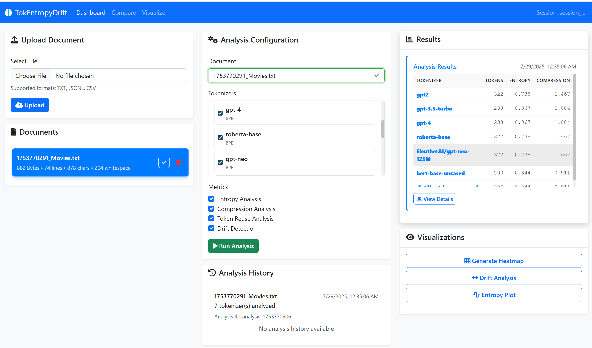
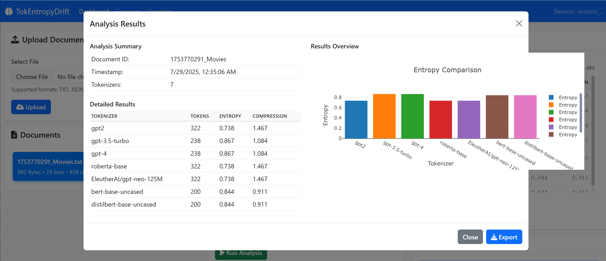

# TokEntropyDrift

*Tokenization Entropy and Drift Explorer ("ted")*

[](https://goreportcard.com/report/github.com/RevBooyah/TokEntropyDrift)
[](https://go.dev/)
[](https://opensource.org/licenses/MIT)
[](https://github.com/RevBooyah/TokEntropyDrift/actions)
[](https://github.com/RevBooyah/TokEntropyDrift/releases)

TokEntropyDrift is a research and engineering tool for analyzing and visualizing how modern LLM tokenizers segment, compress, and diverge across corpora. It provides entropy-based metrics, cross-tokenizer drift analysis, and rich visualizations for debugging and comparing BPE, WordPiece, SentencePiece, and custom tokenizers.

---

## 📌 Project Overview

This project is designed for:

* **NLP researchers** evaluating tokenizer efficiency and behavior
* **LLM developers** debugging token boundaries and drift
* **Prompt engineers** optimizing prompt structure for compression
* **Tool builders** embedding tokenizer analysis in CI or dashboards

## 🖥️ User Interface

TokEntropyDrift provides an intuitive web-based dashboard for analyzing tokenization behavior:

### Main Dashboard


The main dashboard allows you to:
- Upload and manage text documents
- View document statistics (lines, characters, whitespace)
- Run analysis across multiple tokenizers
- Monitor analysis progress in real-time

### Analysis Results


The analysis results modal provides:
- Compact datatable view of tokenizer performance
- Key metrics including token count, entropy, and compression ratio
- Easy comparison across different tokenizers
- Detailed breakdown of analysis results

## 🎯 Goals

* Provide reproducible entropy and compression metrics per tokenizer
* Support multi-tokenizer alignment, drift, and visualization
* Generate interactive or headless-ready visual output (CLI-driven)
* Serve as a scientific instrumentation platform for tokenization studies

For full scope, see [`GOALS.md`](./GOALS.md).

---

## 🧩 Core Features

| Feature                        | Status |
| ------------------------------ | ------ |
| CLI-driven tokenizer analysis  | ✅      |
| Multi-tokenizer comparison     | ✅      |
| Entropy & compression metrics  | ✅      |
| Token reuse & drift detection  | ✅      |
| Token boundary overlays        | ✅      |
| Rolling entropy visualizations | ✅      |
| Heatmaps (tokens, entropy)     | ✅      |
| Static & headless image export | ✅      |
| Markdown + LaTeX reporting     | ⚙️     |
| Tokenizer plugin architecture  | ✅      |
| **Advanced Features** |        |
| Caching layer for performance  | ✅      |
| Parallel processing            | ✅      |
| Streaming analysis             | ✅      |
| Plugin system for custom metrics | ✅    |

---

## 🧠 Supported Tokenizers

* GPT-2 / GPT-3.5 / GPT-4 (via `tiktoken`)
* HuggingFace BPE (e.g. RoBERTa, GPT-Neo)
* SentencePiece (e.g. T5, mT5)
* WordPiece (e.g. BERT, DistilBERT)
* OpenAI API tokenizer
* Custom tokenizers (via config + vocab/model files)

See [`tokenizers.md`](./docs/tokenizers.md) for details.

---

## 🛠️ Project Structure

See full breakdown in [`FOLDERS.md`](./FOLDERS.md)

```
/cmd/ted/               # CLI entrypoint
/internal/tokenizers/   # Tokenizer adapters
/internal/metrics/      # Entropy, compression, reuse functions
/modules/               # Optional extensions (e.g., cost, language tools)
/tokenizers/            # User vocab + config
/examples/              # Input corpora (txt, csv, jsonl)
/testdata/              # Golden output for validation
/output/                # Run results (CSV, visualizations, logs)
/docs/                  # All feature documentation
```

---

## 🚀 Quick Start

### Using Docker (Recommended)
```bash
# Clone the repository
$ git clone https://github.com/RevBooyah/TokEntropyDrift.git
$ cd TokEntropyDrift

# Run with Docker Compose
$ docker-compose up

# Or build and run manually
$ docker build -t tokentropydrift .
```

### Local Development Setup
For local development or if you prefer not to use Docker, see [`SETUP.md`](./SETUP.md) for detailed instructions on setting up the Python environment and tokenizers.

### Building from Source
```bash
# Clone and build
$ git clone https://github.com/RevBooyah/TokEntropyDrift.git
$ cd TokEntropyDrift
$ go build -o ted ./cmd/ted

# Run analysis on an input file
$ ./ted analyze examples/english_quotes.txt --tokenizers=gpt2,t5

# Launch the web dashboard
$ ./ted serve --port=8080

# Headless heatmap export
$ ./ted heatmap examples/tech_stack_descriptions.txt --output=out/entropy.svg

# Test advanced features
$ ./ted advanced cache examples/english_quotes.txt
$ ./ted advanced parallel examples/tech_stack_descriptions.txt
$ ./ted advanced streaming examples/large_file.txt
$ ./ted advanced plugins examples/english_quotes.txt
```

---

## 🎨 Visualization Engine

The visualization engine provides comprehensive analysis visualization capabilities:

### **Interactive Visualizations**
- **Heatmaps**: Compare token counts, entropy, compression, and reuse across tokenizers
- **Token Boundary Maps**: Visualize how different tokenizers segment the same text
- **Drift Analysis**: Compare tokenization behavior between models with line charts and bar plots
- **Rolling Entropy Plots**: Analyze entropy patterns over sliding windows
- **Comprehensive Reports**: Multi-page HTML reports with navigation and export capabilities

### **Export Formats**
- **HTML**: Interactive Plotly.js visualizations with zoom, hover, and export
- **PNG/SVG**: Static images for reports and publications
- **Multi-plot Reports**: Comprehensive analysis reports with multiple visualizations

### **Usage Examples**
```bash
# Generate comprehensive visualization report
$ ./ted analyze examples/english_quotes.txt --visualize

# Create specific heatmap
$ ./ted heatmap examples/tech_stack_descriptions.txt --type=entropy

# Interactive token boundary analysis
$ ./ted analyze examples/sample.txt --tokenizers=gpt2,bert --boundary-viz
```

See [`docs/visualization_usage.md`](./docs/visualization_usage.md) for detailed usage guide.

## 🧪 Examples & Visuals

Sample corpora and annotated output:

* `english_quotes.txt`: Entropy + reuse
* `tech_stack_descriptions.txt`: Token count drift
* `source_code_snippets.txt`: Compression analysis

Output visualizations:

* `output/examples/tech_stack_token_drift.png`
* `output/examples/reddit_entropy_heatmap.svg`

See [`examples.md`](./docs/examples.md) for full coverage matrix.

---

## 🧪 Testing and Benchmarking

* End-to-end test validation using golden output
* Token count, entropy, reuse, and drift checked
* Benchmark tokenizer throughput and metric calculation time

```bash
$ ./ted test examples/english_quotes.txt --compare-to=testdata/english_quotes.gpt2.csv
$ ./ted bench tokenize examples/source_code_snippets.txt --tokenizers=gpt2,t5
```

Docs: [`testing.md`](./docs/testing.md), [`benchmarking.md`](./docs/benchmarking.md)

---

## 📐 Token Analysis Formulas

These formulas define the core metrics computed by TokEntropyDrift:

### 1. Token Entropy

Measures the average uncertainty or information content per token.

$$H = -\sum_{i=1}^{n} p_i \cdot \log_2(p_i)$$

Where:
- \( H \): entropy of the token distribution
- \( p_i \): probability of token \( i \), computed from frequency over the sequence

---

### 2. Normalized Entropy

Scales entropy relative to the number of unique tokens (vocabulary size):

$$
H_{\text{norm}} = \frac{H}{\log_2(n)}
$$

Where:
- \( H_{\text{norm}} \in [0, 1] \)
- \( n \): number of unique tokens in the sample

---

### 3. Compression Ratio

Quantifies how efficiently the tokenizer segments text:

$$
\text{Compression Ratio} = \frac{\text{Character Count}}{\text{Token Count}}
$$

Higher values imply more aggressive token compression.

---

### 4. Token Drift (Pairwise Tokenization Distance)

Compares how two tokenizers segment the same text:

$$
\text{Drift}(T_1, T_2) = 1 - \frac{2 \cdot |T_1 \cap T_2|}{|T_1| + |T_2|}
$$

Where:
- \( T_1, T_2 \): token sets or sequences from two tokenizers
- \( |T_1 \cap T_2| \): overlap in token content

---

### 5. Token Reuse Rate

Indicates how often tokens are reused within a sample:

$$
\text{Reuse Rate} = \frac{\text{Count of Reused Tokens}}{\text{Total Tokens}}
$$

---

### 6. Rolling Entropy

Computes localized entropy over a sliding window \( w \):

$$
H_w = -\sum_{i=1}^{w} p_i \cdot \log_2(p_i)
$$

Helps visualize entropy variation across the corpus.

---

## 🧠 Documentation Index

* [`analysis.md`](./docs/analysis.md): Metrics + entropy calculations
* [`tokenizers.md`](./docs/tokenizers.md): Interface and tokenizer support
* [`visualizations.md`](./docs/visualizations.md): Heatmaps + overlays
* [`gaps-opportunities.md`](./docs/gaps-opportunities.md): Project rationale
* [`research.md`](./docs/research.md): Academic use and future directions
* [`goals.md`](./GOALS.md): Core purpose and non-goals
* [`glossary.md`](./docs/glossary.md): Terminology reference

---

## 🤝 Contributing

New adapters, metrics, and visualizations are welcome.

* See [`CONTRIBUTING.md`](./CONTRIBUTING.md) for structure and coding guidelines.
* PRs should focus on modular design and documented features.
* Use GoDoc-style comments and add test data in `/examples/` and `/testdata/`

---

## 📝 License

MIT License — see `LICENSE` file.

---

TokEntropyDrift is built to help you understand, visualize, and debug the first step in every LLM: tokenization. Whether you're building tools, doing research, or just want to see how your text is chopped up—TED gives you the drift.
